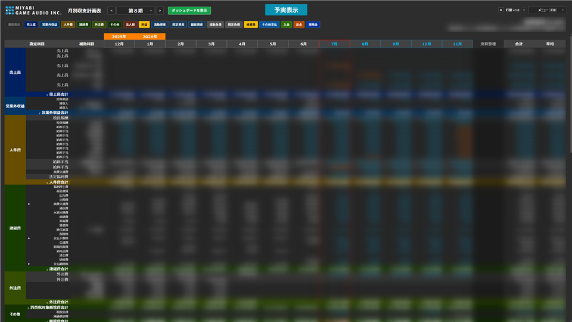
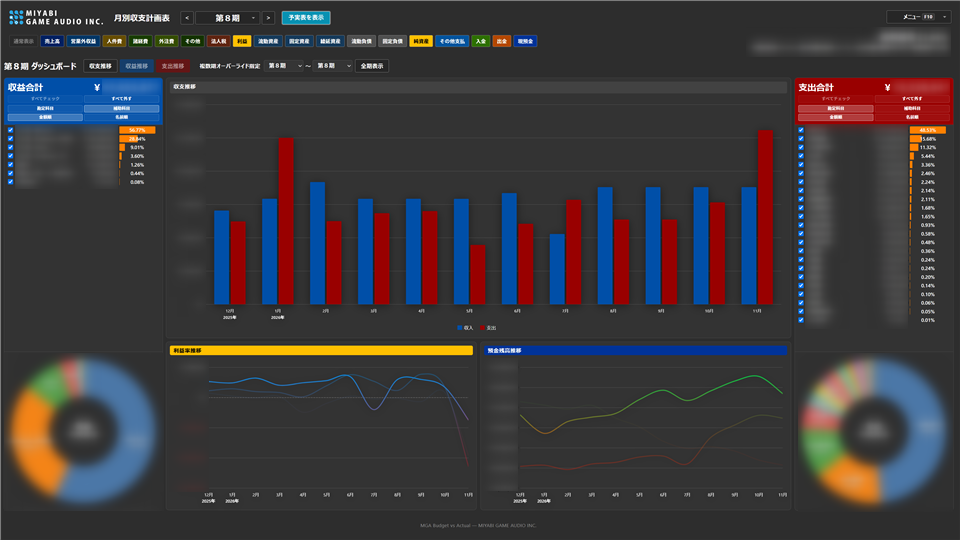
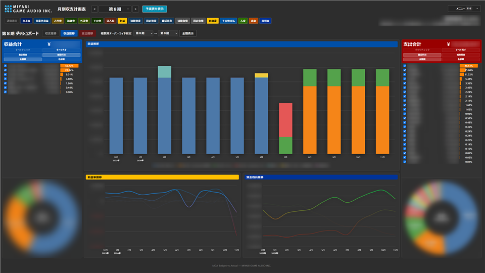
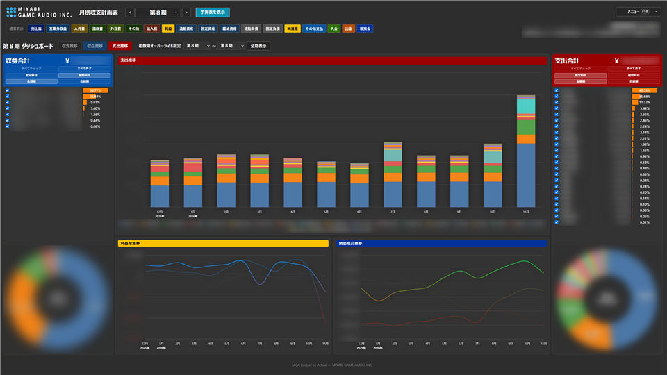
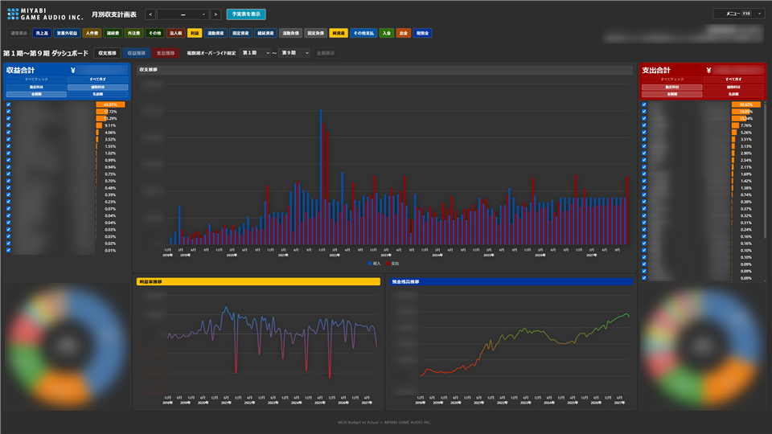

# MGA Budget vs Actual

月別収支計画表を表示する Web アプリです。

仕訳帳は過去を正確に残しますが、経営に必要なのは「これから資金と利益がどう動くか」です。このアプリは、マネーフォワード クラウド会計の CSV を取り込み、**実績と計画を同じ月別表で並べて**見通せるようにします。市販の予実管理パッケージに近い感覚を、**無料・ブラウザだけ・MIT License**で。受注・人件費・外注・税金などの計画や、仕訳の振り分け・表示・色まで自社向けにカスタムできます。**来期に支払う税金や予定納税のシミュレート**もでき、資金繰りの見通しに活かせます。

## 特色と魅力

画面例（科目名・金額の一部はぼかしています）。クリックで拡大します。

<p>
<a href="https://mga-ueda.github.io/MGA-Budget-vs-Actual/image/view.html#budget-table"></a>
<a href="https://mga-ueda.github.io/MGA-Budget-vs-Actual/image/view.html#dashboard-balance"></a>
<a href="https://mga-ueda.github.io/MGA-Budget-vs-Actual/image/view.html#dashboard-revenue"></a>
<a href="https://mga-ueda.github.io/MGA-Budget-vs-Actual/image/view.html#dashboard-expense"></a>
<a href="https://mga-ueda.github.io/MGA-Budget-vs-Actual/image/view.html#dashboard-all-periods"></a>
</p>

- **予実を一枚の表で** … 今期は実績と計画を混在表示。月ヘッダーで境界を切り替え、来期は計画、過去期は実績として確認できます
- **未来の計画を先に置ける** … 受注・人件費・外注・納税などをメニューから入力し、予実表へ反映。高価な予実パッケージなしに見通しを持てます
- **来期の税金・予定納税をシミュレート** … 来期納税見込で、確定申告後に払う税金や予定納税のスケジュールを試算できます
- **数字の根拠まで辿れる** … 実績セルをダブルクリックすると仕訳明細へドリルダウン
- **推移を視覚で掴む** … ダッシュボードで収支・収益・支出のチャート、期範囲や勘定／補助科目の切り替え
- **創業から現在までの長期推移も見られる** … 今期だけでなく「全期表示」で、利益率や預金残高の推移を創業期から一気にグラフ化。単年の良し悪しに振り回されず、収益力の定着や資金余力の厚みを俯瞰でき、計画の根拠にもなります
- **自社の科目運用に合わせて育てる** … 仕訳定義・税率・表示・色・CSV 名パターンを柔軟にカスタム。設定はエクスポート／インポート可能
- **KPI をヘッダーで常時確認** … 総利益率や労働分配率など、健全性の目安をすぐ確認

## プライバシー

このアプリは **一切の利用者情報を収集しません**。会計 CSV・計画値・設定などのデータは **あなたの端末（ブラウザの保存領域と、選択した CSV フォルダ）にしか存在せず**、サーバーや外部サービスへ **アップロードされることはありません**。処理はブラウザ内だけで完結します。

## 前提

このアプリは **マネーフォワード クラウド会計** から出力した CSV を読み込む前提です。

- **対応:** マネーフォワード クラウド会計のエクスポート CSV
- **非対応:** freee・弥生・その他の会計ソフトの CSV（対応予定はありません）

起動時に、次の **3種類** が入ったフォルダを指定します（クラウド会計の帳票・データのエクスポートを想定）。

| 種類 | 既定のファイル名形式 | 例 |
|------|----------------------|-----|
| 仕訳データ | `仕訳データ_YYYY-MM-DD_YYYY-MM-DD.csv` | `仕訳データ_2018-12-07_2019-11-30.csv` |
| 貸借対照表（月次推移） | `貸借対照表_月次推移_YYYYMMDD_HHMM.csv` | `貸借対照表_月次推移_20260627_0759.csv` |
| 総勘定元帳 | `総勘定元帳_YYYYMMDD_HHMM.csv` | `総勘定元帳_20260627_0759.csv` |

同名が複数ある場合は、ファイル名の新しい方を使用します。ファイル名が合わない場合は、メニュー「その他」の **CSV名定義** でパターンを調整できます（中身はマネーフォワード形式である必要があります）。

エクスポート時は、推移表などに含まれる **会計上まだ未実現の仕訳** も対象に含めておくことをおすすめします。計画や予実の連続性を保ちやすくなります。

### CSV の配置（期ごとのフォルダ）

CSV の配置は **期ごとのサブフォルダ構成を前提** とします。会計期が進むと CSV は複数期分になるため、親フォルダ直下にフラットに置かず、期ごとにフォルダを分けてください。アプリはサブフォルダも検索するため、親フォルダを一度選べば全期を読み込めます。

例:

```
MF-CSV/                 ← アプリで選択するフォルダ
├── 第1期/
│   ├── 仕訳データ_2018-12-07_2019-11-30.csv
│   ├── 貸借対照表_月次推移_20191201_1200.csv
│   └── 総勘定元帳_20191201_1200.csv
├── 第2期/
│   ├── 仕訳データ_2019-12-01_2020-11-30.csv
│   ├── 貸借対照表_月次推移_20201201_1200.csv
│   └── 総勘定元帳_20201201_1200.csv
└── 第8期/
    ├── 仕訳データ_...
    ├── 貸借対照表_月次推移_...
    └── 総勘定元帳_...
```

フォルダ名は `第1期`・`第2期` … のように期が分かればよく、厳密な命名規則はありません。同じ期の 3 種類は、必ず同じサブフォルダに揃えてください。複数期の CSV を一つのフォルダに混ぜて置かないでください。

人件費マスタを一括で作る場合は、任意で **マネーフォワード給与** の「従業員情報」CSV も使えます（必須ではありません）。メニュー「人件費」で読み込んだ内容はブラウザに保存されるため、**読み込み時に一度あれば十分**です。会計 CSV フォルダに置き続ける必要はなく、取り込み後は削除して構いません。

## 使う

次の URL をブラウザで開いてください。

- **アプリ:** [https://mga-ueda.github.io/MGA-Budget-vs-Actual/](https://mga-ueda.github.io/MGA-Budget-vs-Actual/)

1. **初回のみ**、上記 CSV が入った **フォルダを選択**
2. **2回目以降**は、保存したフォルダから毎回自動で CSV を読み込み

> **Chrome または Edge** をご利用ください（フォルダ選択機能のため）。

## 取扱説明書

操作方法・計画値の入れ方・予実の確認・ダッシュボード、およびマネーフォワード CSV の準備手順は、次を参照してください。

- [取扱説明書](https://mga-ueda.github.io/MGA-Budget-vs-Actual/manual.html)

アプリ内では **メニュー（F10）→ 取扱説明書** から、同じ内容を新規ウィンドウで開けます。

## バージョン

現在のバージョンは **<!--APP_VERSION-->v 1.00<!--/APP_VERSION-->** です。更新履歴は README には載せず、[GitHub のコミット履歴](https://github.com/mga-ueda/MGA-Budget-vs-Actual/commits/main) で確認できます。アプリのメニュー「バージョン」内の「更新履歴」からも同じページを開けます。

## CSV の更新

マネーフォワードから CSV を出し直すタイミングの目安は、**月初**です。先月分の仕訳ミスが直ったあと、金額の大きい入出金が一段落してからの更新をおすすめします。出した CSV をフォルダに置き、アプリでは次を使います。

- **再読み込み** … 同じフォルダのまま、最新の CSV を読み直します（日常の更新はこちら）
- **フォルダ変更** … 参照先フォルダ自体を変えたいときだけ使います（毎回必要ではありません）

## 開発者向け

ソースは `src/` にあり、処理ごとにサブフォルダ分けしています。

| フォルダ | 内容 |
|----------|------|
| `ui/` | 画面・エントリ（`plan.js`） |
| `parse/` | CSV 解析（仕訳・従業員・ドリルダウン） |
| `csv/` | フォルダ選択・読込・ファイル名定義 |
| `config/` | アプリ設定・表示設定・税率・人件費計画 |
| `enrich/` | 予実表データへの計画行付加 |

`plan.css` とビルド成果物 `plan.bundle.js` は `src/` 直下です。ソースを変更した場合はバンドルを再生成してください。

表示バージョンは `src/config/appVersion.js` の `APP_VERSION` だけを更新し、`node build.mjs` を実行してください。メニュー・README・取扱説明書へ自動反映されます。

```powershell
node build.mjs
```

## ライセンス

**無料**で使え、ソースも公開しています。ライセンスは [MIT License](LICENSE)（Copyright © MIYABI GAME AUDIO INC.）です。

商用・非商用を問わず、コピー・改変・再配布・自社向けのカスタム利用が自由です。社内ツールとして育てたり、必要な部分だけ取り込むのも歓迎します。利用にあたって料金はかかりません。

> 不具合の可能性や税務上の責任については、末尾の **免責事項** を必ずお読みください。

ファビコンの絵文字画像は [Twemoji](https://github.com/twitter/twemoji) です。グラフィックは [CC BY 4.0](https://creativecommons.org/licenses/by/4.0/)（Emoji artwork by Twemoji, licensed under CC BY 4.0）です。

## 免責事項

本アプリは、**MIYABI GAME AUDIO INC. での運用を前提に開発・デバッグ**したものです。他社・他環境での十分な検証は行っておらず、**不具合がある可能性が大いにあります**。表示や計算の結果を鵜呑みにしないでください。

税金・社会保険・源泉徴収などを含む試算や表示に誤りがあった場合でも、**当社は一切の責任を負いません**。納税額や申告内容の最終判断には使わず、**税理士など専門家にご相談ください**。本ソフトウェアは見通しのための補助ツールであり、会計・税務アドバイスを提供するものではありません。

MIT License の無保証条項にも従います。利用はすべて自己責任でお願いします。